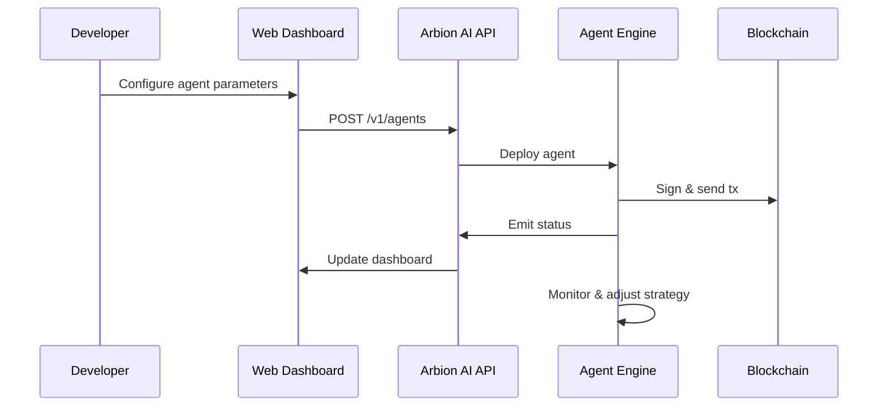

# Arbion AI — The AI Protocol for Web3 Builders

**Deploy intelligent AI agents on CEX, DEX, and DeFi protocols with zero infrastructure setup.**

> "For builders, by builders: build better DeFi products with AI-powered intelligence."

---

## 📚 Table of Contents

1. [Overview](#overview)
2. [Vision & Mission](#vision--mission)
3. [Key Use Cases](#key-use-cases)
4. [Core Features](#core-features)
5. [Deep Dive: AI Agent Engine](#deep-dive-ai-agent-engine)
6. [Integration Flow](#integration-flow)
7. [Architecture & Data Flow](#architecture--data-flow)
8. [Tech Stack & Frameworks](#tech-stack--frameworks)
9. [Security & Governance](#security--governance)
10. [Community & Support](#community--support)

---

## 🔍 Overview

Arbion AI is a decentralized agent protocol designed to empower Web3 builders with automated, intelligent workflows. By abstracting away complex infrastructure and on-chain mechanics, Arbion AI lets you focus on strategy and user experience. Whether developing arbitrage bots, market makers, or portfolio rebalancing tools, Arbion AI provides the building blocks you need.

---

## 🎯 Vision & Mission

**Vision:** Democratize AI-driven finance by enabling developers of all levels to integrate advanced trading and automation tools into their dApps.
**Mission:** Deliver a seamless, plug‑and‑play protocol that unites AI, smart contracts, and real‑time data, so builders can innovate without friction or overhead.

---

## 🔑 Key Use Cases

* **Arbitrage Strategies:** Automatically detect and exploit price differences across CEXes and DEXes in milliseconds.
* **Market Making:** Maintain liquidity positions and capture spread with minimal manual intervention.
* **Portfolio Rebalancing:** Schedule on-chain transactions to rebalance assets according to predefined risk profiles.
* **On-Chain Monitoring:** Monitor smart contract events and trigger custom actions (alerts, trades, or governance votes).
* **Yield Optimization:** Integrate with lending/borrowing protocols to maximize APY based on real‑time rate shifts.

---

## ⭐ Core Features

| Feature                   | Why It Matters                                                                                                  |
| ------------------------- | --------------------------------------------------------------------------------------------------------------- |
| **AI-Driven Automation**  | Reduces manual coding by leveraging pre-trained models for order routing, signal analysis, and trade execution. |
| **Data-Backed Decisions** | Access combined feeds from on-chain oracles, CEX order books, and off-chain indicators for robust strategies.   |
| **Zero-Code Integration** | Instantly deploy agents via REST calls—no contract compilation, migration, or DevOps needed.                    |
| **Privacy & Security**    | Keys encrypted client-side; computation occurs off‑chain to keep sensitive logic hidden.                        |
| **Multi-Chain Support**   | Unified interface for Ethereum, BNB Smart Chain, Polygon, and other EVM networks.                               |
| **Tokenized Compute**     | Use \$ARAI tokens as credits, incentivizing efficient agent behavior and decentralized governance.              |

---

## ⚙️ Deep Dive: AI Agent Engine

Arbion’s AI Agent Engine is the core component that runs user-defined strategies. It comprises:

1. **Strategy Parser:** Validates and translates high-level strategy configurations into executable tasks.
2. **Model Hub:** Hosts pre-trained AI/ML models for signal generation, pattern recognition, and risk assessment.
3. **Execution Manager:** Orchestrates order placement, gas estimation, and transaction signing in a reliable, fault-tolerant manner.
4. **Feedback Loop:** Continuously monitors agent performance and adapts parameters (e.g., slippage tolerance, trade size) for optimal outcomes.

---

## 🔄 Integration Flow

1. **Developer** configures strategy via UI or direct API call.
2. **API** validates request and stores configuration.
3. **Engine** spins up agent tasks, signs transactions, and broadcasts them.
4. **Blockchain** confirms transactions, triggering callbacks.
5. **Engine** ingests on-chain results and refines strategy in real-time.

---

## 🛠 Tech Stack & Frameworks

| Layer               | Technologies & Frameworks                   |
| ------------------- | ------------------------------------------- |
| **Frontend**        | Next.js, React, TypeScript, Tailwind CSS    |
| **Backend API**     | Node.js, Express, TypeScript                |
| **Agent Engine**    | Python, TensorFlow, PyTorch                 |
| **Smart Contracts** | Solidity, Hardhat, Ethers.js                |
| **Oracles & Data**  | Chainlink, The Graph                        |
| **Infrastructure**  | Docker, Kubernetes, AWS/GCP, Cloudflare CDN |

---

## 🔒 Security & Governance

* **Client-Side Encryption:** Private keys never leave the user’s device.
* **Off-Chain Execution:** Sensitive logic stays hidden, reducing on-chain footprint.
* **Token Governance:** \$ARAI holders vote on protocol upgrades, fee models, and new agent templates.
* **Audit Trails:** Complete logs of agent actions and on-chain events for compliance.

---

## 🤝 Community & Support

Bergabunglah dengan komunitas Arbion AI untuk diskusi, dukungan, dan update terbaru:

| Platform        | Link                                                         |
| --------------- | ------------------------------------------------------------ |
| **Website**     | [https://arbion.org](https://arbion.org)                   |
| **Telegram**    | [https://t.me/Arbion\_AI](https://t.me/Arbion_AI)            |
| **X (Twitter)** | [https://x.com/Arbion\_AI](https://x.com/Arbion_AI)          |
| **GitHub**      | [https://github.com/Arbion-AI](https://github.com/Arbion-AI) |
| **Email**       | [support@arbion.org](mailto:support@arbion.org)        |

*Built with ❤️ for the Web3 community.*
